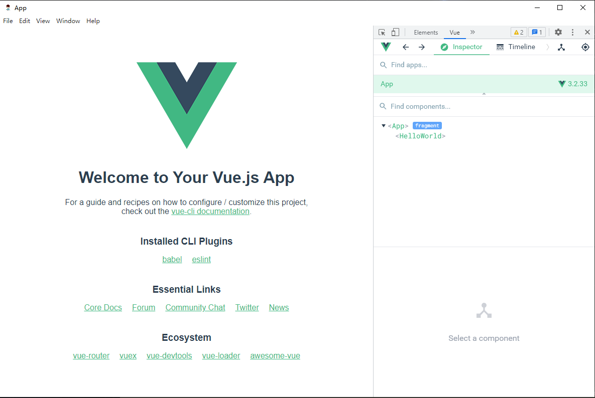

# electron-vue-template
+ __使用 vue.js 快速开发electron跨平台桌面应用__
+ __webpack 5.72+ 版本__
+ __vue 3.2+ 版本__
+ __vuex 4.0+ 版本__
+ __vue-router 4.0+ 版本__
+ __vue-devtools 6.4+ 版本__
+ __typescript 4.6+ 版本__
+ __electron 18.2+ 版本__
+ __sql.js 1.6+ 版本__
+ __node版本 16.13.2__
+ __npm 版本 8.1.2__
+ npm 下载源 https://registry.npm.taobao.org/

### 脚本说明
1. `git clone https://github.com/Liting1/electron-vue-template.git`
2. `npm install`
3. `npm start` 本地开发桌面应用 electron + vue3
4. `npm run build` 使用 electron-builder 打包桌面应用
5. `npm run publish` 快速构建版本,自动递增版本号,需要保证git 工作区域是干净的，才能够运行
5. `npm run web-serve` 在本地浏览器开发渲染进程作为web应用
6. `npm run web-build` 构建打包web应用
5. `npm run packager-build` 使用 electron-packager 打包生产

> **说明：**
> 
> 运行命令中的 env 参数表示应用程序的使用环境，包含开发环境(dev)、测试环境(test)、体验环境(exp)、生产环境(pro)。
> 
> 运行命令中的 mode 产生表示运行模式, 包含开发模式(development)、生产模式(production)。对应与webpack配置中的mode选项

### 常见问题

1. 打包应用程序时需要下载 electron-v18.2.0-win32-x64.zip 文件，下载速度很慢，下载失败。
> window系统，可以将 electron-v18.2.0-win32-x64.zip 已经下载好的文件直接复制到 `C:\Users\liting\AppData\Local\electron\Cache`文件夹下, 注：第二个目录时对应用户的目录，每个人的可能不一样

2. electron是其他版本的可以选择从该链接下载：https://npm.taobao.org/mirrors/electron/ electron打包所需文件所有版本下载地址

3. 下载安装依赖时如果比较慢，或者是使用npm下载electron依赖比较慢
可以使用 cnpm 从新下载依赖,

4. 若在使用cnpm 安装依赖完毕运行后出现vuex报错，请查看实际下载的版本是否和package.json 中的版本号是否一样，如果不一样则单独指定vuex版本从新下载

5. 若在安装过程中出现360警告或者是什么病毒的全部忽略，全都允许

6. 若在运行打包时候出现如下错误`Error: Cannot find module 'fs/promises'` 则需要将本地的node版本升级到 14+ 以上版本方可解决


### 功能
1. 热加载开发
2. 打包生成App
3. 应用更新
5. vue3 + typescript 全家桶
7. sass
8. ts-node
9. 支持 vue-devtools 调试

i

### 项目目录结构

```
|—— app               项目打包后输出的源文件目录
|—— pack              打包成App的输出目录
|—— builder           webpack 构建应用配置目录
|—— doc               项目文档和所需文件目录
|—— config            应用打包配置目录
|—— src               项目资源目录
|	 |—— main             主线程文件目录
|	 |—— pages            其他渲染页面--子窗口页面
|	 |—— renderer	        主渲染线程目录
|    |—— static           静态资源目录
|—— .babelrc            babel 配置文件
|—— .gitignore          git 配置文件
|—— package-lock.json
|—— package.json
|—— README.md

```


### 代办
1. eslint
2. 原生模块构建
